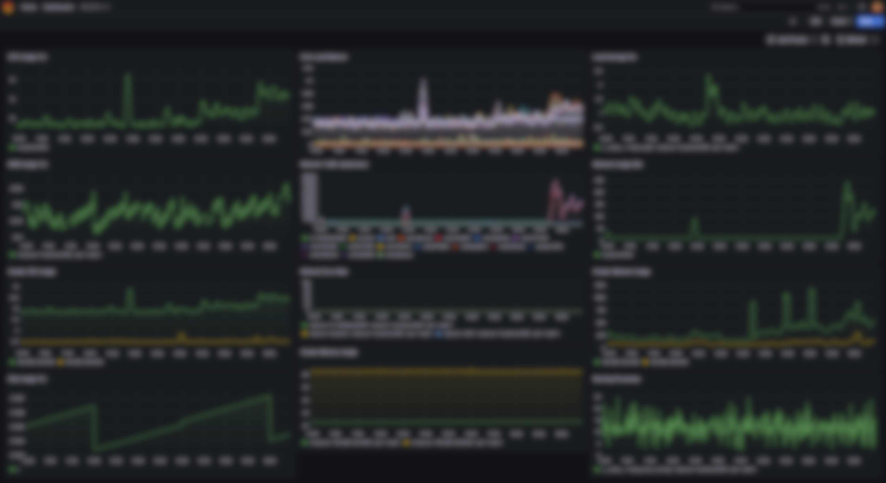
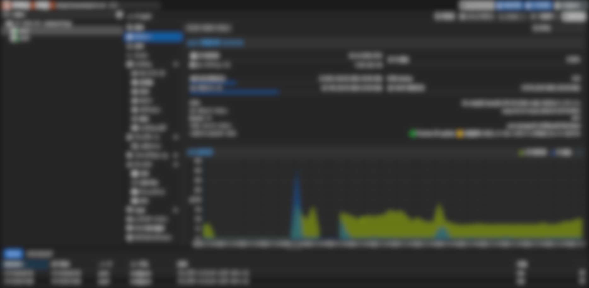

# Hi, I'm techfish!!

  
  
  
  

## About Me

- Student developer interested in technology, automation, and network security
- Operating and managing everything from Minecraft servers to web services on self-hosted infrastructure
- Strong interest in large-scale cloud infrastructure technologies
- OSS contributor, including projects like [Hono](https://github.com/honojs/hono)
- Running portfolios and bots on my own infrastructure
- Enjoy aerial photography and flying drones with DJI Mini 3

## Skills & Technologies

### Languages & Frameworks
`Python` / `JavaScript` / `TypeScript` / `Swift` / `Flutter` / `Node.js` / `Next.js`

### DevOps & Server Management
- Linux (Ubuntu Server, systemd), Proxmox VE, Docker, k3s, Windows Server
- Virtualization: Proxmox VE, VirtualBox, Hyper-V
- Databases: PostgreSQL, MySQL, Redis

### Networking & Security
- VPN: WireGuard, Tailscale, DHCP, DNS (Unbound, Nginx)
- Firewalls: iptables, fail2ban, ModSecurity, CrowdSec
- SSL/TLS: Let's Encrypt

### Web & App Development
- Frontend / Backend: Next.js, JS/TS
- iOS / Android: Swift, Flutter

### Automation & Monitoring
- Jenkins, Zabbix, Grafana, Prometheus, Gitea, Pterodactyl Panel, Mattermost, Active Directory (partial setup)

## Experience

- Providing multiple medium-scale [Minecraft servers](https://techfish.dev/services)
- Moderator of a 2,000+ member Discord community
- Development and deployment of software for schools
- Automatic deployment for my [portfolio website](https://techfish.dev/)
- Building, operating, and maintaining a [large-scale Discord bot](https://github.com/techfish-11/SwiftlyTTS)
- Contributions to [Hono](https://github.com/honojs/hono) via [pull requests](https://github.com/honojs/hono/pull/4171)

## Devices

| Device           | Details                 |
|------------------|-------------------------|
| Laptop           | MacBook Air M4          |
| Desktop PC       | Intel Core i7 14th Gen  |
| Smartphone       | Galaxy S25              |
| Drone            | DJI Mini 3              |

## Contact
https://techfish.dev/inquiry

## Domains

- [sakana11.org](https://sakana11.org/)
- [swiftlybot.com](https://swiftlybot.com)
- [techfish.dev](https://techfish.dev/)

## Screenshots

  
  

  Left: Home server monitoring dashboard in Grafana / Right: Proxmox VE management panel

