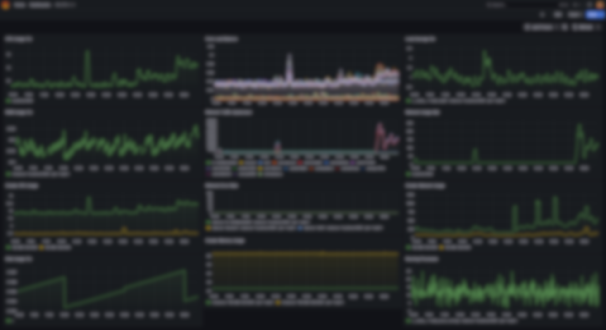
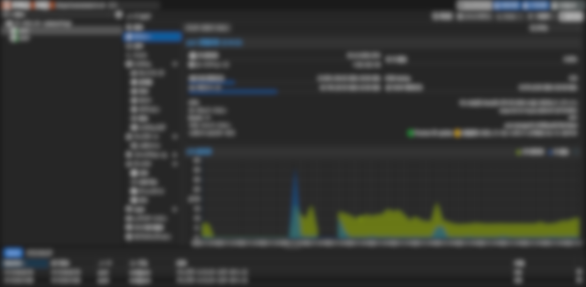

<h1 align="center">
  こんにちは、techfishです。
</h1>  

  
  
  
  

## 自己紹介

- 技術、オートメーション、ネットワークセキュリティを理解している学生デベロッパー
- MinecraftサーバーからWebサービスまで、自宅インフラ上で構築・運用
- 大規模クラウドインフラ技術と、ISPのバックボーン技術に興味がある
- OSSへのコントリビュート（例：Hono）
- ポートフォリオやボットを自前インフラで運用
- DJI Mini 3でのドローン飛行・空撮が趣味

## スキル・技術

### 言語・フレームワーク
`Python` / `JavaScript` / `TypeScript` / `Swift` / `Flutter` / `Node.js` / `Next.js`

### DevOps・サーバー管理
- Linux（Ubuntu Server、systemd）、Proxmox VE、Docker、k3s、Windows Server
- 仮想化：Proxmox VE、VirtualBox、Hyper-V
- データベース：PostgreSQL、MySQL、Redis

### ネットワーク・セキュリティ
- VPN：WireGuard、Tailscale
- DHCP、DNS（Unbound、Nginx）
- ファイアウォール：iptables、fail2ban、ModSecurity、CrowdSec
- SSL/TLS：Let's Encrypt

### Web・アプリ開発
- フロントエンド／バックエンド：Next.js、JavaScript / TypeScript
- iOS／Android：Swift、Flutter

### 自動化・監視
- Jenkins、Zabbix、Grafana、Prometheus、Gitea、Pterodactyl Panel、Mattermost、Active Directory（構築の一部）、SNMP

## 実績・活動

- 中規模Minecraftサーバーの提供・運営  
  https://techfish.dev/services
- 2,000人規模のDiscordコミュニティ モデレーター
- 学校向けソフトウェアの開発・導入
- ポートフォリオサイトの自動デプロイ構築  
  https://techfish.dev/
- 大規模Discordボットの設計・運用  
  https://github.com/techfish-11/SwiftlyTTS
- HonoへのPull Requestによる貢献  

## 使用デバイス

| デバイス | 詳細 |
|----------|------|
| ノートPC | MacBook Air M4 |
| デスクトップ | Intel Core i7 第14世代 |
| スマートフォン | Galaxy S25 |
| ドローン | DJI Mini 3 |

## お問い合わせ
https://techfish.dev/inquiry

## ドメイン

- https://sakana11.org/
- https://swiftlybot.com
- https://techfish.dev/

## スクリーンショット

  
  

  左：Grafana自宅サーバー監視ダッシュボード / 右：Proxmox VE管理パネル

